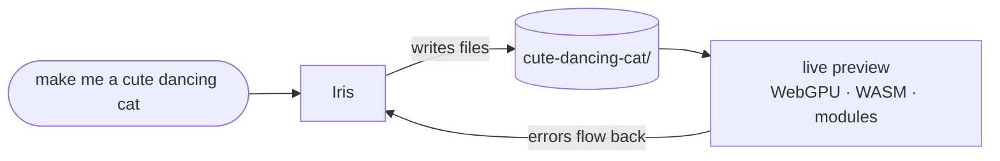

<h1>Iris 🌈</h1>

<table>
<tr>
<td width="300" valign="top">

<sub><i>Iris is the Greek goddess of the rainbow. She carried messages between the gods and people, and the rainbow was her bridge. Ours is called <code>bridge.ts</code>.</i></sub>
</td>
<td valign="top">

<h3>The whole Hermes agent.<br/>One HTML file. One TypeScript file.<br/>Zero npm.</h3>

<p><i>Hermes was the messenger of the gods.<br/>Iris was the other one. The rainbow one.</i></p>

<p>
  <a href="https://iris.bonsai.stream"></a>
</p>

<p>
  
  
  
  
  
</p>

A full coding agent with chat, a terminal, 20 tools, memory, sub-agents and a live preview of whatever
it builds, squeezed into two files you can actually read. They're big, but there's nothing else.

</td>
</tr>
</table>

<table>
<tr>
<td width="33%" valign="top">

### `index.html`
The whole app, about 11k lines. The UI, the agent loop, every tool and a terminal emulator we wrote
by hand. Preact and htm are pasted right in, so nothing gets downloaded.

</td>
<td width="33%" valign="top">

### `bridge.ts`
The Bun half, about 7k lines of TypeScript and only Bun built-ins. It serves the page, runs your
commands and holds your API keys, so the browser never sees them.

</td>
<td width="33%" valign="top">

### ~~`node_modules`~~
Doesn't exist. No `package.json`, no lockfile, no CDN, no pip.

</td>
</tr>
</table>

## Run it

```sh
git clone https://github.com/nisten/iris
cd iris
bun bridge.ts
```

That's it. Open the `http://localhost:8787` link it prints. All you need is [Bun](https://bun.sh) 1.4 or newer.

> [!TIP]
> **No API key, no signup.** Iris comes hooked up to our free Ternary Bonsai models, so a fresh clone just works.
> If the free servers are ever down, it asks for your own key. Or skip installing and hit **try it live** up top.

## Cheat sheet

```sh
bun bridge.ts                        # web UI on http://localhost:8787
bun bridge.ts --tui                  # same agent, full screen in your terminal
bun bridge.ts stop                   # stop one you left running in the background

# build in the folder you're standing in
HERMES_WORKSPACE=. bun bridge.ts

# open it from your phone or another machine, with a password
HERMES_HOST=127.0.0.1,100.64.0.9 HERMES_WEB_PASSWORD='a long passphrase' bun bridge.ts
#   then go to http://100.64.0.9:8787 and log in

# any hosted endpoint with an API key
HERMES_LLM_BASE=https://openrouter.ai/api/v1 \
HERMES_LLM_KEY=sk-or-... \
HERMES_LLM_MODEL=qwen/qwen3-coder \
  bun bridge.ts

# your own Bonsai key instead of the shared one
HERMES_BONSAI_KEY=... bun bridge.ts

# your own local server, no key needed
HERMES_LLM_BASE=http://127.0.0.1:8080/v1  HERMES_LLM_MODEL=my-model          bun bridge.ts   # llama.cpp
HERMES_LLM_BASE=http://localhost:11434/v1 HERMES_LLM_MODEL=qwen2.5-coder:14b bun bridge.ts   # Ollama
```

## Make me a cute dancing cat

Type that in. Iris writes the files and you watch the code stream in, and the preview runs it as soon as
it's saved, WebGPU and all. If it crashes, the error goes back to Iris and it tries to fix it.



| | **Web mode** (default) | **Workspace mode** |
|---|---|---|
| **Files live** | in your browser | in a folder on your machine, `iris-projects/` |
| **The agent can** | read, write and edit files | everything: shell, git, tests, Chrome, tmux etc |
| **Good for** | web apps and games | real projects |
| **Risk** | low, it can't run commands | it's your shell, so use *ask* to approve changes |

The live demo is web mode only.

## What's inside

<table>
<tr>
<td width="50%" valign="top">

**The agent loop**<br/>
Answers stream in live. Tools run in parallel, it retries when the API flakes and shrinks old history
when the chat gets long. Steer it while it's working, or edit and branch off any old message.

</td>
<td width="50%" valign="top">

**A terminal you can actually use**<br/>
A real shell, drawn by a terminal emulator we wrote by hand. vim, htop and tmux all work.
The agent types into the same shell you do, so you can watch it.

</td>
</tr>
<tr>
<td valign="top">

**20 tools**<br/>
Files, shell, background jobs, Chrome, tmux, web search, vision,
todo lists, and decision cards when it needs your call.

</td>
<td valign="top">

**Sub-agents**<br/>
Up to 6 working at once, all on one live screen. Talk to any of them while they work.

</td>
</tr>
<tr>
<td valign="top">

**Memory + skills**<br/>
It remembers you and your projects, and writes itself little how-to notes it can reuse next time.

</td>
<td valign="top">

**Sessions**<br/>
Every chat is saved and searchable. Pick any of them back up, or export it as markdown or JSONL.

</td>
</tr>
<tr>
<td valign="top">

**A little IDE**<br/>
Project files, editor tabs with highlighting, and a preview you can dock or make full screen.
A live tok/s counter shows how fast the model is going.

</td>
<td valign="top">

**It lives in your terminal too**<br/>
The same agent, full screen in your terminal, with tabs, mouse support and a side panel.

</td>
</tr>
</table>

## Models

| Model | Where | What it's like |
|---|---|---|
| **`bonsai-9b`** (default) | `pre.bonsai.stream` | ternary, thinks, sees images, 262K context |
| `bonsai-4b` / `bonsai-2b` | `pre.bonsai.stream` | ternary, tiny and fast, sees images, 262K context |
| `bonsai-27b` | `api.bonsai.stream` | the big one |
| **anything OpenAI-compatible** | your server | OpenRouter, Together, OpenAI, Groq, DeepSeek, llama.cpp, vLLM, sglang, Ollama etc |

Switch models any time from the header (**Alt+M**). The free servers are shared, so sometimes they're slow.
Your own key or your own server fixes that.

## Why only two files?

Upstream Hermes pulls in a big Python + npm tree: Playwright, camofox, `uv` packages and a `curl | bash`
bootstrap. That's a lot of other people's code running on your machine, and some of it has had CVEs.
We dropped all of it. All you have to trust is two files and the Bun binary.

- A web page can't run commands, so the page asks and the bridge does it.
- The bridge only listens on localhost unless you tell it otherwise, and it wants a secret token.
- **API keys never reach the page.** The bridge adds them to the LLM call itself.
- Previews run on their own origin, so whatever you build can't get at your shell.

## More

Everything else is in **[AGENTS.md](./AGENTS.md)**: settings, env vars, https, shortcuts, known issues and
what's next. It's also the guide if you want to hack on Iris.

Not there yet: `cronjob` and a native Anthropic `/v1/messages` path.

---

<p align="center"><a href="https://iris.bonsai.stream"></a></p>

## License

Copyright 2026 Nisten Tahiraj

Licensed under the Apache License, Version 2.0 (the "License"); you may not use this project except in
compliance with the License. You may obtain a copy of the License at
<https://www.apache.org/licenses/LICENSE-2.0>. Unless required by applicable law or agreed to in writing,
software distributed under the License is distributed on an "AS IS" BASIS, WITHOUT WARRANTIES OR CONDITIONS
OF ANY KIND, either express or implied. See the License for the specific language governing permissions and
limitations under the License.

Built on Hermes Agent (MIT, Copyright (c) 2025 Nous Research), Preact (MIT, Copyright (c) Jason Miller)
and htm (Apache-2.0, Copyright 2018 Google Inc.).

<p align="center"><sub>Author: Nisten Tahiraj</sub></p>
